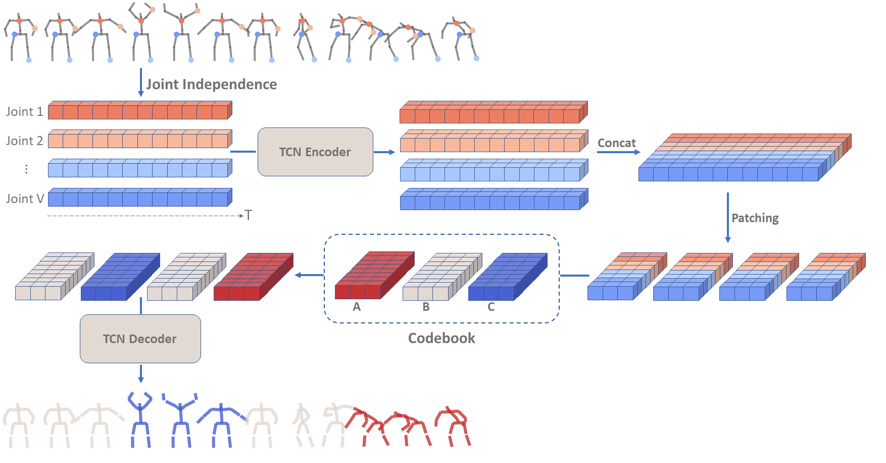
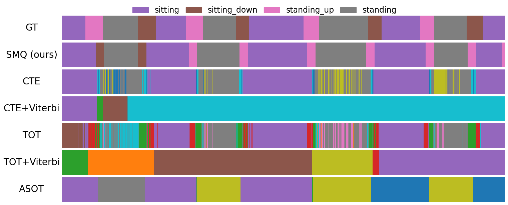
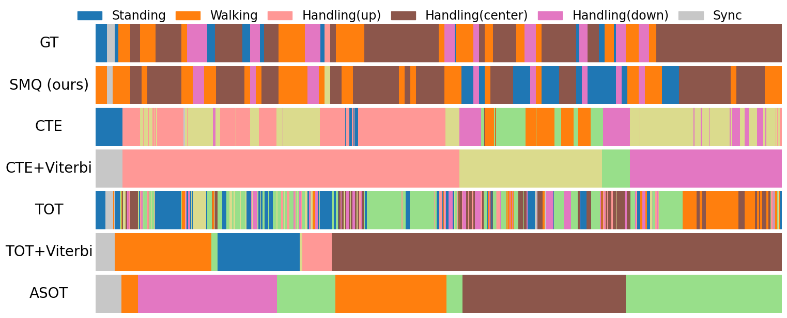
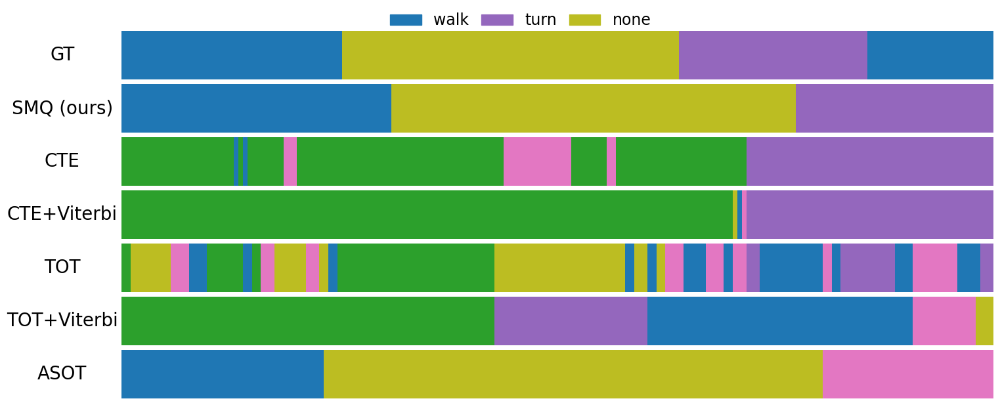

# Skeleton Motion Words for Unsupervised Skeleton-Based Temporal Action Segmentation (ICCV 2025)

Official implementation of the paper **"Skeleton Motion Words for Unsupervised Skeleton-Based Temporal Action Segmentation"**. 

[Paper](https://openaccess.thecvf.com/content/ICCV2025/html/Gokay_Skeleton_Motion_Words_for_Unsupervised_Skeleton-Based_Temporal_Action_Segmentation_ICCV_2025_paper.html) |
[Project Page](https://uzaygokay.github.io/SMQ/) |
[Poster](https://iccv.thecvf.com/virtual/2025/poster/2081) |
[Video](https://www.youtube.com/watch?v=iHThrI9TzF0)

<p align="left">
  
  <br>
  <em><strong>Skeleton Motion Quantization (SMQ)</strong> is an unsupervised framework that temporally segments long untrimmed skeleton sequences into meaningful actions without supervision.</em>
</p>

## Overview

**SMQ** learns discrete, patch-level representation of skeleton motion using vector quantization.

<p align="center">
  
</p>

A dilated TCN encodes each joint independently into the latent space. The embeddings are grouped into short temporal patches and quantized into "motion words” using a learned codebook. TCN decoder reconstructs the original skeleton sequence from these discrete patches.

## Qualitative Results

We present qualitative results from the HuGaDB, LARa, and BABEL datasets, illustrating the action segments predicted by SMQ alongside the ground truth.

<p align="center">
  
  
</p>

<p align="center">
  <em>HuGaDB</em>&nbsp;&nbsp;&nbsp;&nbsp;&nbsp;&nbsp;&nbsp;&nbsp;&nbsp;&nbsp;&nbsp;&nbsp;&nbsp;&nbsp;&nbsp;&nbsp;&nbsp;&nbsp;&nbsp;&nbsp;&nbsp;&nbsp;&nbsp;&nbsp;&nbsp;&nbsp;&nbsp;&nbsp;&nbsp;&nbsp;&nbsp;&nbsp;&nbsp;&nbsp;&nbsp;&nbsp;&nbsp;&nbsp;&nbsp;&nbsp;&nbsp;&nbsp;&nbsp;&nbsp;&nbsp;&nbsp;&nbsp;&nbsp;&nbsp;&nbsp;&nbsp;&nbsp;&nbsp;&nbsp;&nbsp;&nbsp;&nbsp;&nbsp;&nbsp;&nbsp;&nbsp;&nbsp;&nbsp;&nbsp;&nbsp;&nbsp;&nbsp;&nbsp;&nbsp;&nbsp;&nbsp;&nbsp;&nbsp;&nbsp;&nbsp;&nbsp;&nbsp;&nbsp;&nbsp;
  <em>LARa</em>
</p>

<p align="center">
  
</p>

<p align="center">
  <em>BABEL</em>
</p>

The results show that SMQ effectively detects recurring actions and avoids the over-segmentation and under-segmentation issues observed in prior unsupervised methods.

## Datasets

The datasets can be downloaded from :

- **HuGaDB (v2)**: [https://github.com/romanchereshnev/HuGaDB](https://github.com/romanchereshnev/HuGaDB)
- **LARa (v3 - OMoCap annotated)**: [https://zenodo.org/records/8189341](https://zenodo.org/records/8189341)
- **BABEL**: [https://babel.is.tue.mpg.de/](https://babel.is.tue.mpg.de/)


### Data Preparation

Each dataset has a preprocessing script in `src/data/` that converts raw files into:
```
features/      (.npy skeleton tensors)
groundTruth/   (.txt frame-wise labels)
mapping/       (action-id mapping)
```

**HuGaDB**
  ```bash
  python src/data/hugadb.py -i <raw_hugadb_dir> -o data/
  ```

**LARa** 
  ```bash
  python src/data/lara.py -i <raw_lara_dir> -o data/
  ```

**BABEL**\
First create BABEL subsets following: https://github.com/line/Skeleton-Temporal-Action-Localization \
This will create train and val pkl files for each subset and then run :
  ```bash
  python src/data/babel.py -i train.pkl val.pkl -o data/ -p {babel1|babel2|babel3}
  ```

Example (BABEL-Subset 1) :
```
python src/data/babel.py -i train_split1.pkl val_split1.pkl -o data/ -p babel1
```


### Folder Structure
Preprocessing scripts should create subfolders under `data/` directory for each dataset. Inside each dataset folder (ex. `data/hugadb/`), the structure should be as follows:

```
data                    # root path for all datasets
├─ dataset_name/        # root path for single dataset
│  ├─ features/         # skeleton features
│  │  ├─ fname1.npy 
│  │  ├─ fname2.npy
│  │  ├─ ...      
|  ├─ groundTruth/      # ground truth labels
│  │  ├─ fname1.txt
│  │  ├─ fname2.txt
│  │  ├─ ...      
|  ├─ mapping           # mapping folder
│  │  ├─ mapping.txt    # mapping file for matching
```


## Installation
To create the conda environment run the following command:

```bash
conda env create -n smq -f environment.yml
conda activate smq
pip install --no-deps -r requirements.txt

```


## Training
To train the model run `main.py` with `train` action.
```
python main.py --action=train --dataset=DS
```
where DS is `hugadb`, `lara`, `babel1`, `babel2` or `babel3`.

## Evaluation
To evaluate the model run `main.py` with `eval` action.
```
python main.py --action=eval --dataset=DS
```

To evaluate a pretrained model (provided in `models/pretrained/`):
```
python main.py --action=eval --dataset=DS --ckpt models/pretrained/DS.model
```

## Acknowledgement
In our code we made use of the following repositories: [MS-TCN](https://github.com/yabufarha/ms-tcn), [CTE](https://github.com/annusha/unsup_temp_embed) and [VQ](https://github.com/lucidrains/vector-quantize-pytorch). We sincerely thank the authors for their codebases!

## Citation
If you use the code, please cite our [paper](https://arxiv.org/abs/2508.04513):
```latex
@InProceedings{Gokay_2025_ICCV,
    author    = {G\"okay, Uzay and Spurio, Federico and Bach, Dominik R. and Gall, Juergen},
    title     = {Skeleton Motion Words for Unsupervised Skeleton-Based Temporal Action Segmentation},
    booktitle = {Proceedings of the IEEE/CVF International Conference on Computer Vision (ICCV)},
    month     = {October},
    year      = {2025},
    pages     = {12101-12111}
}
```